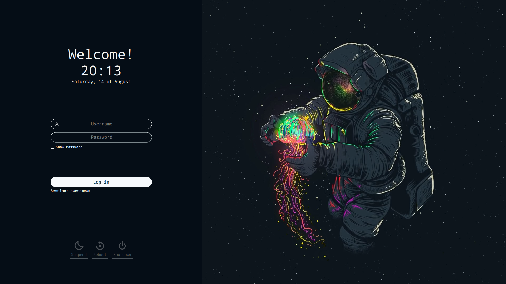

# sddm-theme-astronaut

A theme for the [SDDM login manager](https://github.com/sddm/sddm) made specifically for the Lubuntu distribution, but can also serve any other, that uses SDDM.

**Preview**


## Install

> _Assumes that you've installed and configured SDDM correctly_ (if not [read more](https://wiki.archlinux.org/title/SDDM))

### From AUR

```sh
yay -Syu
yay -S sddm-theme-astronaut
```


### Manually

1. Open terminal, and clone the repository with:

   ```sh
   git clone https://github.com/totoro-ghost/sddm-astronaut.git ~/astronaut/
   ```

2. Them move it as follows:

   ```sh
   sudo mv ~/astronaut/ /usr/share/sddm/themes/
   ```

### Common Step

Edit (using [micro](https://micro-editor.github.io) here) `/etc/sddm.conf`, so that it looks like this:

```sh
sudo micro /etc/sddm.conf  # use any text editor with raised privileges
---
[Theme]
Current=astronaut
   ```

## Language and time format

- The theme interface is in English, so if you want to change the language to Spanish (or some other language), you must open the directory `sddm-astronaut/Translations/en_GB` and copy the contents of `theme.conf` to another folder `sddm-astronaut/Translations/es_ES` (or to one of the [language code](https://www.fincher.org/Utilities/CountryLanguageList.shtml)) and make relevant changes.
- You can also change the time format.
- To change the default wallpaper put desired image in the `sddm-astronaut/Assets/Wallpapers` folder and add the name of the image followed by its extension (`.jpg` or `.png`) in `theme.conf` file.

## Credits

Based on the theme [`Sugar Dark for SDDM`](https://github.com/MarianArlt/sddm-sugar-dark) by **MarianArlt**.

The icons used were at courtesy of the [`Boxicons`](https://boxicons.com/) team.

## License

[GNU Lesser General Public License v3.0](LICENSE)
